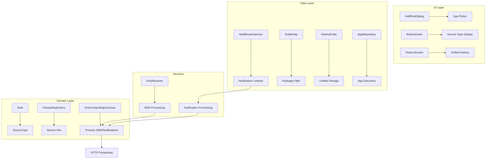

# Notification Support Implementation

## Overview

This document describes the implementation of notification forwarding support in the SMS Forwarder app. The app now supports forwarding both SMS messages and notifications from other apps to HTTP endpoints based on configurable rules.

## Architecture Overview



## Key Components

### 1. NotifRouterService

**File:** `app/src/main/java/com/zerodev/smsforwarder/data/service/NotifRouterService.kt`

- Extends `NotificationListenerService`
- Captures notifications from other apps via `onNotificationPosted()`
- Extracts: `packageName`, `appLabel`, `title`, `text`, `postTime`, and JSON-serializable extras
- Filters out system notifications and ongoing notifications
- Forwards notifications to `SmsForwardingUseCase` for processing

**Key Features:**
- Automatic app name resolution using PackageManager
- System notification filtering to avoid noise
- Comprehensive logging with emoji indicators
- Helper methods for checking notification access permissions

### 2. Enhanced Rule Model

**Files:** 
- `app/src/main/java/com/zerodev/smsforwarder/domain/model/Rule.kt`
- `app/src/main/java/com/zerodev/smsforwarder/domain/model/SourceType.kt`

**New Fields:**
- `source: SourceType` - SMS or NOTIFICATION
- `packageFilter: String?` - Required for notification rules, null means all packages

**Validation Rules:**
- Package filter is required for notification rules
- SMS rules ignore package filter
- Pattern matching applies to SMS body or notification title+text combined

### 3. App Repository with Efficient Loading

**File:** `app/src/main/java/com/zerodev/smsforwarder/data/repository/AppRepository.kt`

**Features:**
- **MRU Caching:** Uses `UsageStatsManager` to get recently used apps
- **Search with Debounce:** 300ms debounced search with live suggestions
- **Paging Support:** Pagination with configurable page size (20 items)
- **Fallback Strategy:** Common apps list when usage stats unavailable
- **Memory Efficient:** Lazy loading and caching strategies

**Performance Optimizations:**
- Top 20 MRU apps cached on startup
- Search results limited to top 5 suggestions
- Background loading with coroutines
- Efficient filtering and sorting

### 4. Database Schema Changes

**Version 4 Schema:**

#### RuleEntity Updates:
```sql
CREATE TABLE rules (
    id INTEGER PRIMARY KEY AUTOINCREMENT,
    name TEXT NOT NULL,
    pattern TEXT NOT NULL,
    source TEXT NOT NULL,           -- "SMS" or "NOTIFICATION"
    package_filter TEXT,            -- Package name for notifications
    is_regex INTEGER NOT NULL,
    endpoint TEXT NOT NULL,
    method TEXT NOT NULL,
    headers TEXT NOT NULL,
    is_active INTEGER NOT NULL,
    created_at INTEGER NOT NULL,
    updated_at INTEGER NOT NULL
);
```

#### HistoryEntity Updates:
```sql
CREATE TABLE forwarding_history (
    id INTEGER PRIMARY KEY AUTOINCREMENT,
    rule_id INTEGER,
    matched_rule INTEGER NOT NULL,
    sender_number TEXT,             -- For SMS only
    message_body TEXT NOT NULL,
    source_type TEXT NOT NULL,      -- "SMS" or "NOTIFICATION"
    source_package TEXT,            -- For notifications only
    source_app_name TEXT,           -- For notifications only
    notification_title TEXT,        -- For notifications only
    notification_text TEXT,         -- For notifications only
    endpoint TEXT,
    method TEXT,
    request_headers TEXT NOT NULL,
    request_body TEXT,
    response_code INTEGER,
    response_body TEXT,
    status TEXT NOT NULL,
    error_message TEXT,
    timestamp INTEGER NOT NULL,
    forwarded_at INTEGER,
    FOREIGN KEY(rule_id) REFERENCES rules(id) ON DELETE CASCADE
);
```

### 5. Enhanced UI Components

#### AddRuleDialog Updates:
- Radio buttons for SMS/Notification source selection
- App picker dropdown with search functionality
- Package name display alongside app names
- Validation for notification rules requiring package selection

#### RulesScreen Updates:
- Source type indicators (📱 for SMS, 🔔 for notifications)
- Package name display for notification rules
- Enhanced rule cards with source information

#### HistoryScreen Updates:
- Unified history showing both SMS and notifications
- Source-specific information display
- Enhanced statistics with source type breakdown

### 6. HTTP Client Enhancements

**File:** `app/src/main/java/com/zerodev/smsforwarder/data/remote/client/HttpClient.kt`

**New Methods:**
- `forwardNotification()` - Dedicated notification forwarding
- `forwardPayload()` - Generic payload forwarding with source type header

**Payload Structure:**
```json
{
    "sourceType": "NOTIFICATION",
    "packageName": "com.whatsapp",
    "appLabel": "WhatsApp",
    "title": "New message",
    "text": "Hello world",
    "postTime": 1640995200000,
    "extras": {...},
    "timestamp": 1640995200000
}
```

## Permissions and Setup

### Required Permissions:
```xml
<uses-permission android:name="android.permission.BIND_NOTIFICATION_LISTENER_SERVICE" />
```

### Service Declaration:
```xml
<service
    android:name=".data.service.NotifRouterService"
    android:enabled="true"
    android:exported="true"
    android:permission="android.permission.BIND_NOTIFICATION_LISTENER_SERVICE">
    <intent-filter>
        <action android:name="android.service.notification.NotificationListenerService" />
    </intent-filter>
</service>
```

### User Setup Required:
1. Enable "Notification Access" in Android Settings
2. Navigate to: Settings > Apps > Special app access > Notification access
3. Enable SMS Forwarder in the list

## Testing Strategy

### Unit Tests:
- `NotificationPatternMatcherTest` - Pattern matching for notifications
- `RuleValidationTest` - Enhanced validation with package filters
- `AppRepositoryTest` - App discovery and caching

### Integration Tests:
- `NotifRouterServiceTest` - Service lifecycle and notification processing
- `DatabaseMigrationTest` - Schema migration testing

### UI Tests:
- `AddRuleFlowTest` - Complete rule creation flow with app selection
- `HistoryDisplayTest` - Unified history display testing

## Performance Considerations

### Memory Management:
- App list pagination to handle devices with 100+ apps
- MRU cache limited to 20 items
- Lazy loading of app icons and metadata

### Battery Optimization:
- Efficient notification filtering to reduce processing
- Background processing with proper coroutine scoping
- Minimal system notification interception

### Network Efficiency:
- Shared HTTP client for both SMS and notifications
- Retry logic with exponential backoff
- Proper request/response logging

## Security Considerations

### Privacy:
- Notification content is only processed for matching rules
- No persistent storage of notification content beyond history
- User control over which apps' notifications are processed

### Permissions:
- Notification listener permission requires explicit user consent
- Clear explanation of why permission is needed
- Graceful degradation when permission is not granted

## Debugging and Logging

### Log Tags:
- `NotifRouterService` - Notification processing logs
- `SmsForwardingUseCase` - Unified processing logs with emoji indicators
- `AppRepository` - App discovery and caching logs

### Debug Features:
- Comprehensive history logging for all messages/notifications
- Status indicators in UI (✓/✗ for rule matching)
- Detailed error messages and troubleshooting steps

## Future Enhancements

### Planned Features:
1. **Advanced Filtering:** Regex support for package names
2. **Batch Processing:** Multiple notification forwarding
3. **Custom Payloads:** User-defined JSON templates
4. **Analytics:** Detailed forwarding statistics and trends
5. **Backup/Restore:** Rule and history export/import

### Performance Improvements:
1. **Smart Caching:** Intelligent app metadata caching
2. **Background Sync:** Periodic rule optimization
3. **Resource Monitoring:** Memory and CPU usage tracking

## Migration Guide

### From SMS-Only to SMS+Notifications:

1. **Database Migration:** Automatic schema upgrade to version 4
2. **Existing Rules:** All existing rules default to SMS source type
3. **UI Updates:** New source selection in rule creation
4. **Permission Request:** Prompt for notification access when creating notification rules

### Backward Compatibility:
- All existing SMS rules continue to work unchanged
- History entries maintain compatibility
- API endpoints receive source type information for differentiation

## Conclusion

The notification support implementation provides a comprehensive solution for forwarding both SMS and app notifications while maintaining the app's clean architecture and performance characteristics. The efficient app discovery system, unified processing pipeline, and enhanced UI provide a seamless user experience for managing both SMS and notification forwarding rules. 